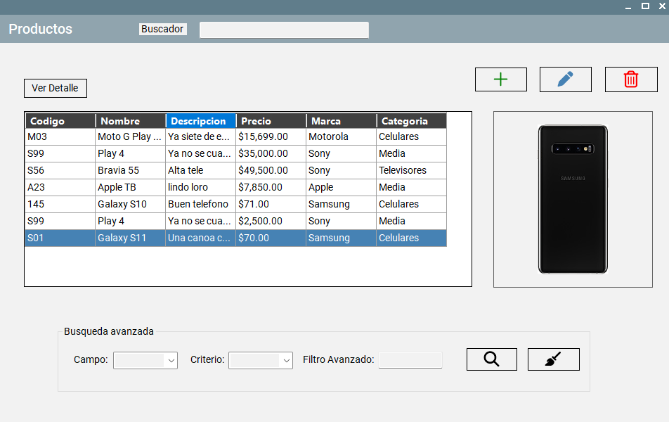
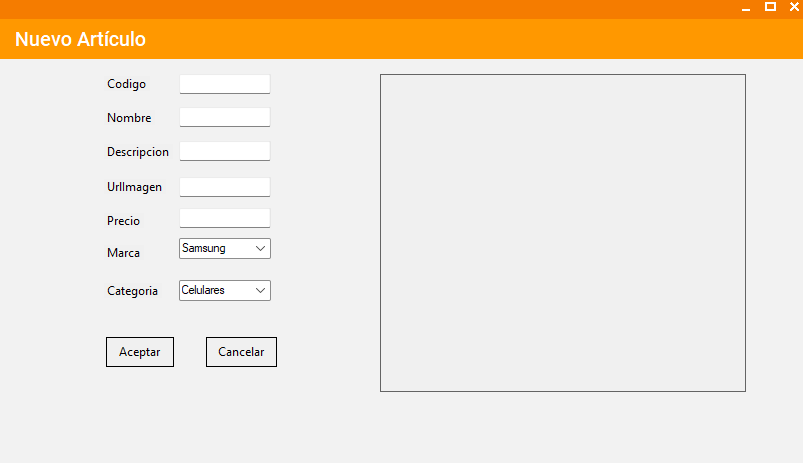
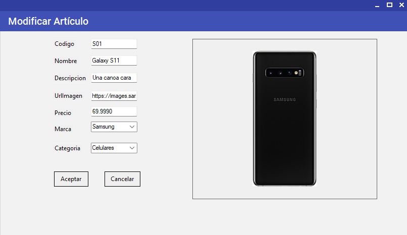

# Sistema de Gestión de Catálogo (.NET)

Aplicación de escritorio para la administración integral de artículos comerciales, desarrollada con un enfoque en arquitectura robusta y experiencia de usuario eficiente.

## Funcionalidades Principales:
- **Gestión Completa (CRUD):** Alta, Baja y Modificación de artículos con validaciones de negocio.
- **Buscador Avanzado:** Motor de filtrado dinámico que permite combinar criterios (Texto, Precio, Rangos) generando consultas SQL optimizadas.
- **Catálogo Visual:** Visualización de imágenes de productos y listados formateados.
- **Base de Datos Relacional:** Integridad referencial con Marcas y Categorías.

## Tecnologías:
- **Core:** C# .NET Framework 4.8
- **GUI:** Windows Forms con diseño personalizado.
- **Datos:** SQL Server, ADO.NET (Modo desconectado).
- **Arquitectura:** Modelo en 3 Capas (Presentación, Negocio, Dominio).

##  Capturas:

*Vista del catálogo principal con filtros activos.*

*Formulario de alta con validación de precios y campos obligatorios.*

*Vista que permite la modificacion en la bases de datos de un articulo seleccionado.*

## Configuración:
1. Clonar el repositorio.
2. Ejecutar el script `CATALOGO_DB.sql` en SQL Server Management Studio.
3. Abrir la solución en **Visual Studio 2022**.
4. ¡Iniciar! 

---
**Autor:** [Matias Fauda] - [Proximamente tengo que pegar link a mi linkedin]
